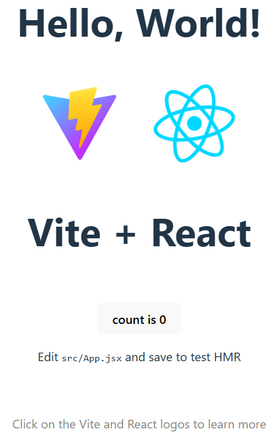

# Hello World

A simple "Hello World" project built using HTML, CSS, and JavaScript to demonstrate the structure of a basic frontend web app.

## 🔗 Live Demo
[View Live](https://sadykovIsmail.github.io/frontend-projects-collection/01-my-first-react-app)

## 🛠️ Built With
- HTML5
- CSS3
- JavaScript

## ✨ Features
- Displays "Hello World" message
- Basic layout and styling

## 📸 Screenshots
<!-- Add your screenshot image here -->
<!-- Example:  -->

## 📦 Getting Started

1. Clone the repository:
   ```bash
   git clone https://github.com/sadykovIsmail/frontend-projects-collection/tree/main/01-my-first-react-app
