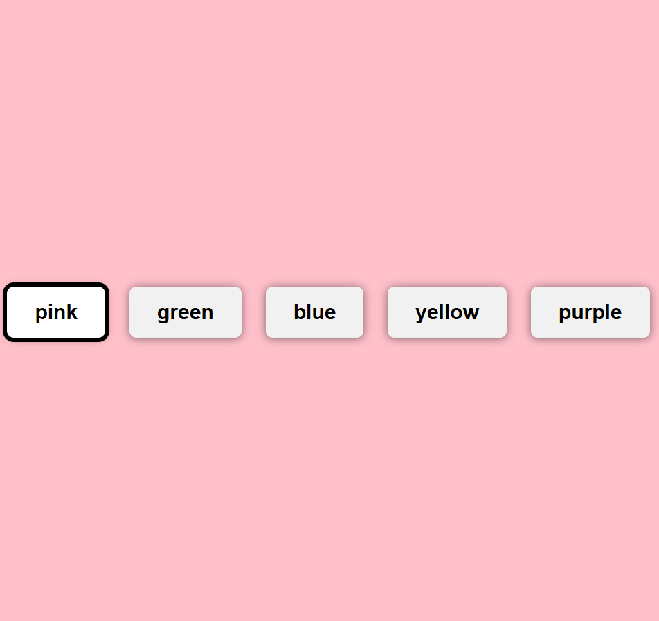

# 🎨 Color Selector

An interactive React app that lets users select and apply colors. This component is reusable, responsive, and perfect for themes, design tools, or UI settings.

## 🔗 Live Demo

[View Live](https://sadykovismail.github.io/frontend-projects-collection/12-color-selector/)

## 🛠️ Built With

- [React](https://reactjs.org/)
- [Vite](https://vitejs.dev/)
- HTML5 + CSS3

## ✨ Features

- Clickable color palette
- Active color preview
- Responsive layout
- Simple and reusable component logic

## 📸 Screenshots



## 📦 Getting Started

### 1. Clone the repository

```bash
git clone https://github.com/sadykovIsmail/frontend-projects-collection.git
cd frontend-projects-collection/12-color-selector
