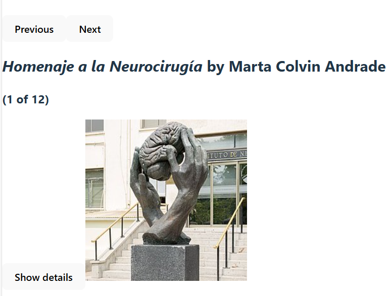

# 🗿 Sculpture Image Renderer

A React-based project that dynamically renders a sculpture image and optionally displays related information or interactivity. This project is part of a frontend component collection, built using Vite and deployed via GitHub Pages.

## 🔗 Live Demo

[View Live](https://sadykovismail.github.io/frontend-projects-collection/13-sculpture-image-rendercd/)

## 🛠️ Built With

- [React](https://reactjs.org/)
- [Vite](https://vitejs.dev/)
- HTML5
- CSS3

## ✨ Features

- Displays a sculpture image
- Clean layout with scalable component structure
- Responsive styling using modern CSS
- Lightweight and fast thanks to Vite

## 📸 Screenshots



## 📦 Getting Started

### 1. Clone the repository

```bash
git clone https://github.com/sadykovIsmail/frontend-projects-collection.git
cd frontend-projects-collection/13-sculpture-image-render
