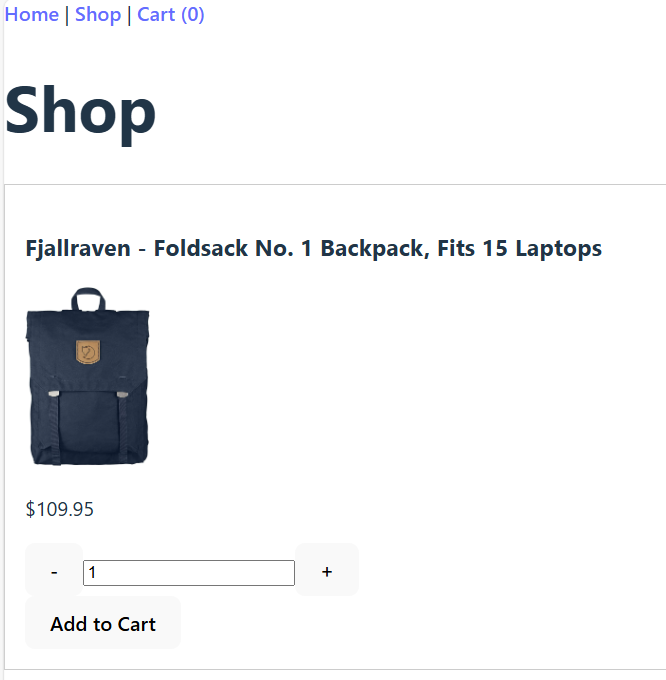

# 🛒 Shopping Cart

A responsive shopping cart web application built using React and Vite. Users can browse products, add them to a cart, and see totals — all on the client side.

## 🔗 Live Demo  
[View Live](https://sadykovismail.github.io/frontend-projects-collection/32-shopping-cart/)

## 🛠️ Built With  
- React  
- JavaScript (ES6+)  
- Vite  
- CSS Modules

## ✨ Features  
- Product listing with images and titles  
- Add/remove items from the cart  
- View cart item count and total price  
- Responsive design

## 📸 Screenshot



## 📦 Getting Started  

To run this project locally:  
```bash
# Clone the repository  
git clone https://github.com/sadykovIsmail/frontend-projects-collection.git  

# Navigate to the project folder  
cd frontend-projects-collection/32-shopping-cart  

# Install dependencies  
npm install  

# Run development server  
npm run dev  

# Build for production  
npm run build  
```


## License

This project is licensed under the MIT License - see the [LICENSE](./LICENSE) file for details.