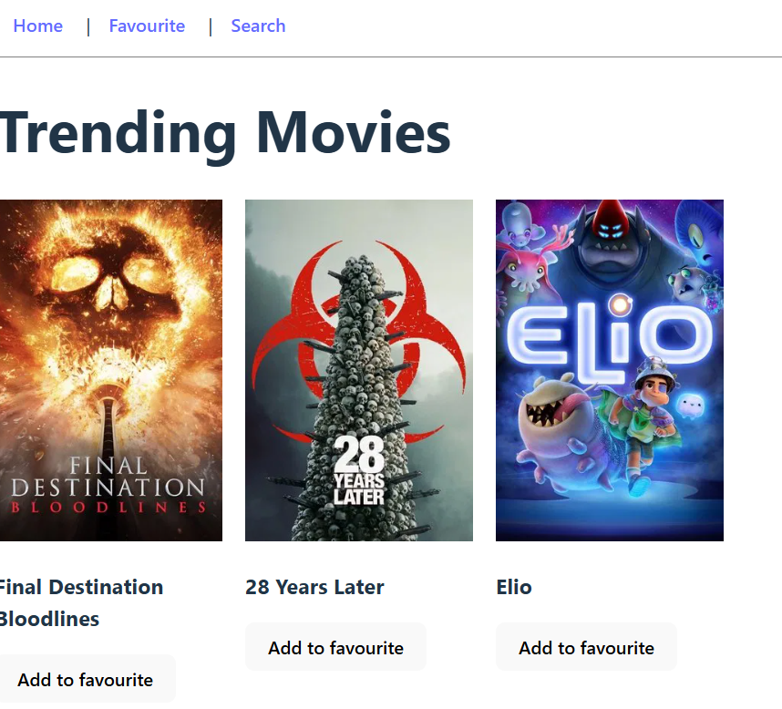

# 🎬 Movie Explorer App

A sleek and responsive movie explorer application built with React and Vite. Users can browse a list of movies and search by title in real-time using a simple, intuitive interface.

## 🔗 Live Demo  
[View Live](https://sadykovismail.github.io/frontend-projects-collection/34-movie-explorer-app/)

## 🛠️ Built With  
- React  
- JavaScript (ES6+)  
- Vite  
- CSS3

## ✨ Features  
- Live movie search  
- Responsive layout  
- Clean and minimal UI  
- Fast loading with Vite

## 📸 Screenshot



## 📦 Getting Started  

To run this project locally:  
```bash
# Clone the repository  
git clone https://github.com/sadykovIsmail/frontend-projects-collection.git

# Navigate to the project folder  
cd frontend-projects-collection/34-movie-explorer-app

# Install dependencies  
npm install

# Run development server  
npm run dev

# Build for production  
npm run build

## License

This project is licensed under the MIT License - see the [LICENSE](./LICENSE) file for details.